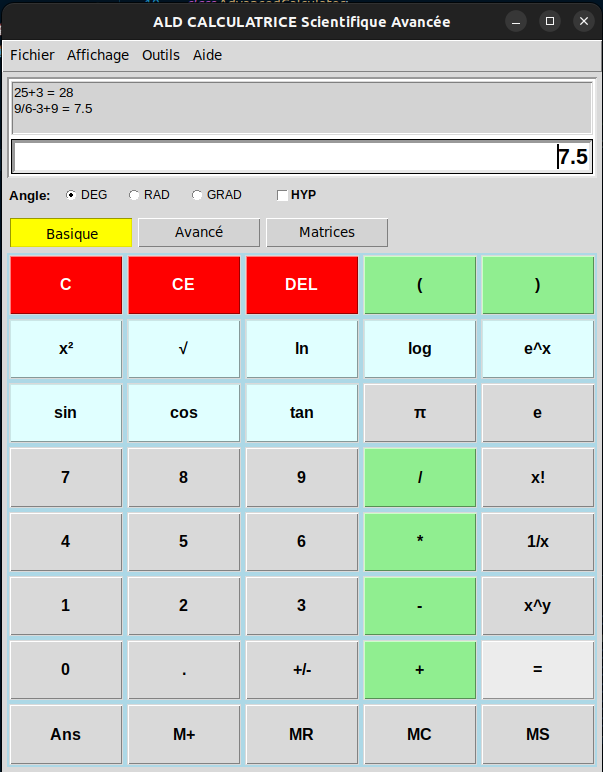
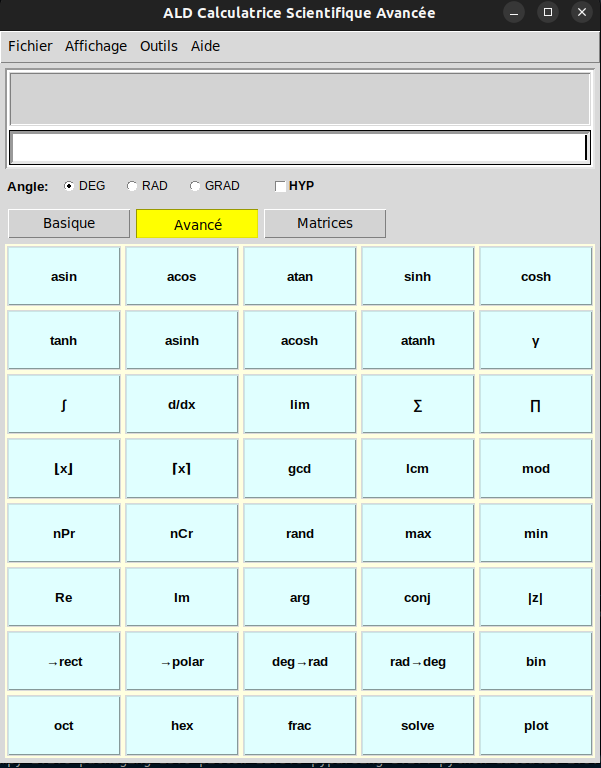
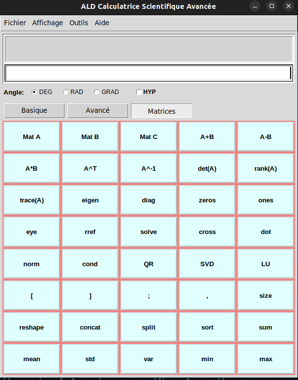
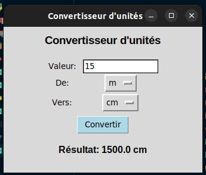
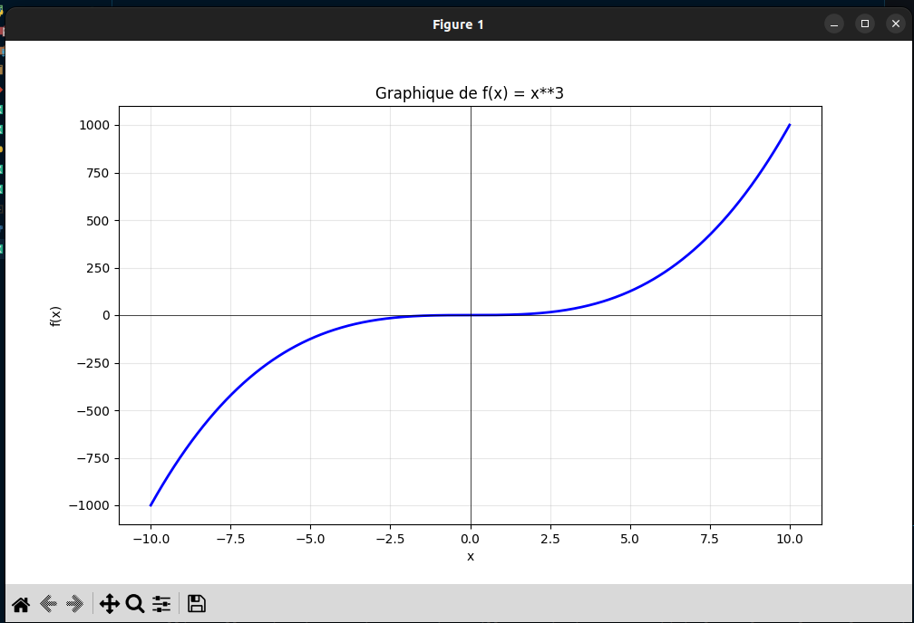
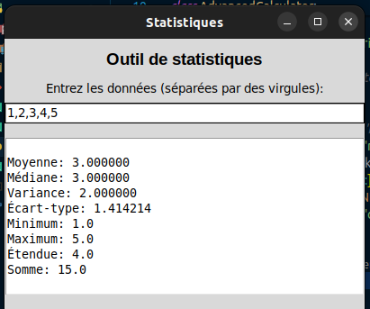

# 🧮 Advanced Scientific Calculator - Calculatrice Scientifique Avancée


> **Calculatrice scientifique de niveau professionnel avec capacités matricielles avancées**

Une calculatrice scientifique complète développée en Python qui combine fonctions mathématiques classiques, calculs matriciels avancés, visualisation de données et outils statistiques dans une interface utilisateur moderne et intuitive.

## 📋 Table des Matières
- [Fonctionnalités Principales](#-fonctionnalités-principales)
- [Architecture](#-architecture)
- [Technologies Utilisées](#-technologies-utilisées)
- [Installation Rapide](#-installation-rapide)
- [Guide d'Utilisation](#-guide-dutilisation)
- [Modules et Fonctionnalités](#-modules-et-fonctionnalités)
- [Interface Utilisateur](#-interface-utilisateur)
- [Exemples d'Usage](#-exemples-dusage)
- [Configuration](#-configuration)
- [Tests](#-tests)
- [Documentation](#-documentation)
- [Contribution](#-contribution)
- [Roadmap](#-roadmap)
- [Licence](#-licence)
- [Auteur](#-auteur)

## 🎯 Fonctionnalités Principales

### **Calculs Mathématiques Avancés**

- **Opérations de base** - Addition, soustraction, multiplication, division
- **Fonctions trigonométriques** - sin, cos, tan et leurs inverses
- **Fonctions hyperboliques** - sinh, cosh, tanh et leurs inverses
- **Fonctions logarithmiques** - ln, log₁₀, log₂
- **Fonctions spéciales** - gamma, factorielle, combinaisons, permutations

### **Calcul Matriciel Professionnel**

- **Opérations matricielles** - Addition, soustraction, multiplication
- **Transformations** - Transposée, inverse, déterminant
- **Analyse** - Valeurs propres, rang, trace, norme
- **Matrices spéciales** - Identité, zéros, uns, matrices diagonales
- **Décompositions** - LU, QR, SVD

### **Outils Scientifiques Intégrés**

- **Nombres complexes** - Partie réelle, imaginaire, argument, conjugué
- **Conversions** - Degrés/radians, fractions, bases numériques
- **Statistiques** - Moyenne, médiane, écart-type, variance
- **Graphiques** - Tracé de fonctions mathématiques

### **Interface Utilisateur Moderne**

- **Navigation par onglets** - Interface organisée et intuitive
- **Historique des calculs** - Suivi des opérations précédentes
- **Raccourcis clavier** - Utilisation rapide et efficace
- **Thème professionnel** - Design moderne et ergonomique

## 🏗️ Architecture

```
┌─────────────────────┐    ┌─────────────────────┐    ┌─────────────────────┐
│   Interface GUI     │    │   Moteur de Calcul  │    │   Modules Maths     │
│   (Tkinter)         │◄──►│   (Core Engine)     │◄──►│   (NumPy/SciPy)     │
└─────────────────────┘    └─────────────────────┘    └─────────────────────┘
        │                         │                         │
        │                         │                         │
        ▼                         ▼                         ▼
┌─────────────────────┐    ┌─────────────────────┐    ┌─────────────────────┐
│   Gestionnaire      │    │   Analyseur         │    │   Générateur de     │
│   d'Événements      │    │   d'Expressions     │    │   Graphiques        │
└─────────────────────┘    └─────────────────────┘    └─────────────────────┘
```
### Quelques images :

* Basique


* avance
  
  
* matrice
  
  
* convertion unité
  
* Graphe



* Statisque
* 
 

## 🛠️ Technologies Utilisées

### **Core Technologies**
- **Python 3.8+** - Langage de programmation principal
- **Tkinter** - Interface graphique native
- **NumPy** - Calculs numériques et matriciels
- **SciPy** - Fonctions mathématiques avancées

### **Modules Scientifiques**
- **Matplotlib** - Génération de graphiques
- **Math** - Fonctions mathématiques standard
- **CMath** - Mathématiques complexes
- **Statistics** - Analyses statistiques

### **Utilitaires**
- **Re** - Expressions régulières pour parsing
- **Fractions** - Calculs fractionnaires précis
- **Decimal** - Arithmétique décimale de précision

## 🚀 Installation Rapide

### **Prérequis Système**
```bash
Python 3.8+
pip (gestionnaire de paquets Python)
```

### **Installation Standard**

```bash
# Cloner le dépôt
git clone https://github.com/Delmat237/ALD_Calculator.git
cd ALD_Calculator

# Créer un environnement virtuel (recommandé)
python -m venv calculator_env
source calculator_env/bin/activate  # Linux/Mac
# ou
calculator_env\Scripts\activate     # Windows

# Installer les dépendances
pip install -r requirements.txt

# Lancer la calculatrice
python Calculator_App.py
```

### **Installation avec Conda**
```bash
# Créer un environnement conda
conda create -n calculator python=3.9
conda activate calculator

# Installer les dépendances
conda install numpy matplotlib scipy
pip install -r requirements.txt

# Exécuter l'application
python Calculator_App.py
```

### **Installation Portable**
```bash
# Créer un exécutable standalone
pip install pyinstaller
pyinstaller --onefile --windowed Calculator_App.py

# L'exécutable sera dans le dossier dist/
```

## 📋 Guide d'Utilisation

### **Démarrage de l'Application**

1. **Lancement** : Exécuter `python Calculator_App.py`
2. **Interface** : L'application s'ouvre avec l'onglet "Basique" par défaut
3. **Navigation** : Utiliser les boutons d'onglets pour changer de mode
4. **Calculs** : Saisir les expressions dans le champ principal

### **Modes d'Utilisation**

#### **Mode Basique**
```python
# Opérations arithmétiques
2 + 3 * 4        # Résultat: 14
sqrt(16)         # Résultat: 4.0
sin(pi/2)        # Résultat: 1.0
log(e)           # Résultat: 1.0
```

#### **Mode Avancé**
```python
# Fonctions complexes
sinh(1)          # Fonction hyperbolique
gamma(5)         # Fonction gamma
nCr(10, 3)       # Combinaisons
degrees(pi)      # Conversion radian→degré
```

#### **Mode Matriciel**
```python
# Création de matrices
Mat A: [[1, 2], [3, 4]]
Mat B: [[5, 6], [7, 8]]

# Opérations
A + B            # Addition matricielle
A * B            # Multiplication matricielle
det(A)           # Déterminant
A^T              # Transposée
```

## 🔧 Modules et Fonctionnalités

### **Module Calcul de Base**
```python
class BasicCalculator:
    """Fonctionnalités de calcul standard"""
    - Opérations arithmétiques (+, -, *, /)
    - Fonctions mathématiques (sin, cos, tan, ln, log)
    - Constantes (π, e, φ)
    - Mémoire (M+, MS, MR, MC)
```

### **Module Avancé**
```python
class AdvancedCalculator:
    """Fonctions mathématiques spécialisées"""
    - Fonctions hyperboliques et inverses
    - Nombres complexes
    - Conversions d'unités
    - Fonctions spéciales (gamma, factorielle)
```

### **Module Matriciel**
```python
class MatrixCalculator:
    """Calculs matriciels complets"""
    - Opérations matricielles de base
    - Décompositions (LU, QR, SVD)
    - Analyse spectrale (valeurs propres)
    - Systèmes linéaires
```

### **Module Graphiques**
```python
class PlotGenerator:
    """Génération de graphiques"""
    - Tracé de fonctions 2D
    - Graphiques statistiques
    - Visualisation matricielle
    - Export en formats multiples
```

## 💻 Interface Utilisateur

### **Composants Principaux**

#### **Zone d'Affichage**
- **Champ principal** : Saisie et affichage des expressions
- **Historique** : Derniers calculs effectués
- **Messages d'état** : Informations et erreurs

#### **Panneaux de Contrôle**
- **Options d'angle** : Degrés, Radians, Grades
- **Mode hyperbolique** : Activation/désactivation
- **Précision** : Configuration des décimales

#### **Boutons Fonctionnels**
```python
# Couleurs et organisation
Opérateurs arithmétiques    # Vert clair
Fonctions mathématiques     # Bleu clair
Boutons de contrôle         # Rouge/Orange
Chiffres et points          # Gris standard
```

### **Raccourcis Clavier**
```bash
# Navigation
Entrée/Return     → Calculer (=)
Échap            → Effacer tout (C)
Retour arrière   → Effacer dernier caractère
Delete           → Réinitialiser

# Saisie rapide
0-9              → Chiffres
+ - * /          → Opérateurs
. , (             → Ponctuation et parenthèses
```

## 📊 Exemples d'Usage

### **Calculs Scientifiques**
```python
# Trigonométrie
sin(30°) = 0.5
cos(π/3) = 0.5
tan(45°) = 1.0

# Logarithmes
ln(e) = 1
log₁₀(100) = 2
log₂(8) = 3

# Fonctions spéciales
5! = 120
γ(6) = 120
C(10,3) = 120
```

### **Matrices et Algèbre Linéaire**
```python
# Définition de matrices
A = [[1, 2, 3],
     [4, 5, 6],
     [7, 8, 9]]

B = [[9, 8, 7],
     [6, 5, 4],
     [3, 2, 1]]

# Opérations
A + B = [[10, 10, 10],
         [10, 10, 10],
         [10, 10, 10]]

det(A) = 0  # Matrice singulière
rank(A) = 2 # Rang de la matrice
```

### **Analyses Statistiques**
```python
# Données d'exemple
data = [1, 2, 3, 4, 5, 6, 7, 8, 9, 10]

# Calculs statistiques
Moyenne: 5.5
Médiane: 5.5
Écart-type: 3.03
Variance: 9.17
Min/Max: 1/10
```

### **Nombres Complexes**
```python
# Définition
z1 = 3 + 4j
z2 = 1 - 2j

# Opérations
z1 + z2 = 4 + 2j
z1 * z2 = 11 - 2j
|z1| = 5.0
arg(z1) = 53.13°
```

## ⚙️ Configuration

### **Fichier de Configuration**
```python
# config.py
SETTINGS = {
    'precision': 10,           # Nombre de décimales
    'angle_mode': 'degrees',   # 'degrees', 'radians', 'gradians'
    'complex_mode': False,     # Mode nombres complexes
    'theme': 'modern',         # Thème de l'interface
    'history_size': 50,        # Taille de l'historique
    'auto_save': True          # Sauvegarde automatique
}
```

### **Variables d'Environnement**
```bash
# Configuration avancée
CALCULATOR_THEME=dark
CALCULATOR_PRECISION=15
CALCULATOR_LANGUAGE=fr
CALCULATOR_DEBUG=false
```

### **Personnalisation de l'Interface**
```python
# Thèmes disponibles
THEMES = {
    'classic': {
        'bg_color': '#f0f0f0',
        'button_color': '#e0e0e0',
        'text_color': '#000000'
    },
    'dark': {
        'bg_color': '#2d2d2d',
        'button_color': '#404040',
        'text_color': '#ffffff'
    },
    'professional': {
        'bg_color': '#ffffff',
        'button_color': '#007acc',
        'text_color': '#333333'
    }
}
```

## 🧪 Tests

### **Tests Unitaires**
```bash
# Exécuter tous les tests
python -m pytest tests/

# Tests par module
python -m pytest tests/test_basic.py      # Tests de base
python -m pytest tests/test_advanced.py   # Tests avancés
python -m pytest tests/test_matrix.py     # Tests matriciels
python -m pytest tests/test_gui.py        # Tests interface
```

### **Tests de Performance**
```bash
# Benchmark des calculs
python tests/benchmark.py

# Test de charge
python tests/stress_test.py

# Profiling mémoire
python -m memory_profiler Calculator_App.py
```

### **Couverture de Code**
```bash
# Générer le rapport de couverture
coverage run -m pytest tests/
coverage report -m
coverage html
```

## 📚 Documentation

### **Documentation Technique**
- [Guide d'Installation](docs/installation.md)
- [Référence API](docs/api.md)
- [Architecture Système](docs/architecture.md)
- [Guide de Développement](docs/development.md)

### **Manuels Utilisateur**
- [Guide d'Utilisation](docs/user-guide.md)
- [Tutoriels Avancés](docs/tutorials.md)
- [FAQ et Dépannage](docs/faq.md)
- [Exemples Pratiques](docs/examples.md)

### **Documentation API**
```python
# Générer la documentation automatique
pip install sphinx
sphinx-quickstart docs
sphinx-build -b html docs/ docs/_build/
```

## 🤝 Contribution

### **Comment Contribuer**

1. **Fork** le projet
2. **Créer** une branche feature (`git checkout -b feature/nouvelle-fonctionnalite`)
3. **Commit** les modifications (`git commit -m 'Ajout nouvelle fonctionnalité'`)
4. **Push** vers la branche (`git push origin feature/nouvelle-fonctionnalite`)
5. **Ouvrir** une Pull Request

### **Guidelines de Développement**
- Suivre PEP 8 pour le style de code Python
- Écrire des docstrings complètes
- Ajouter des tests unitaires pour nouvelles fonctionnalités
- Mettre à jour la documentation
- Vérifier la compatibilité cross-platform

### **Structure des Commits**
```bash
# Format recommandé
feat: ajouter support matrices creuses
fix: corriger bug division par zéro
docs: mettre à jour guide utilisateur
test: ajouter tests fonctions complexes
refactor: optimiser moteur de calcul
```

## 🗺️ Roadmap

### **Version 2.1 (Q1 2024)**
- [ ] Support des matrices creuses
- [ ] Calcul symbolique de base
- [ ] Mode programmeur (binaire, hexadécimal)
- [ ] Thèmes personnalisables
- [ ] Sauvegarde des sessions

### **Version 2.2 (Q2 2024)**
- [ ] Intégration SymPy pour calcul symbolique
- [ ] Graphiques 3D interactifs
- [ ] Solveur d'équations différentielles
- [ ] API REST pour intégration externe
- [ ] Mode collaboratif

### **Version 3.0 (Q3 2024)**
- [ ] Interface web (React/FastAPI)
- [ ] Cloud sync et partage
- [ ] Plugins et extensions
- [ ] Machine learning pour suggestion
- [ ] Mode éducatif avec étapes détaillées

## 🔧 Dépannage

### **Problèmes Courants**

#### **Erreurs d'Installation**
```bash
# Problème: ModuleNotFoundError
Solution: pip install -r requirements.txt

# Problème: Tkinter manquant
Solution: sudo apt-get install python3-tk  # Ubuntu/Debian
```

#### **Problèmes de Performance**
```bash
# Calculs lents sur grandes matrices
Solution: Installer BLAS optimisé
pip install openblas-devel

# Interface qui freeze
Solution: Utiliser calculs asynchrones
```

#### **Erreurs de Précision**
```python
# Utiliser Decimal pour haute précision
from decimal import Decimal, getcontext
getcontext().prec = 50  # 50 décimales
```

## 📄 Licence

Ce projet est sous licence **MIT** - voir le fichier [LICENSE](LICENSE) pour les détails complets.

```
MIT License

Copyright (c) 2024 Leonel Azangue (Delmat237)

Permission is hereby granted, free of charge, to any person obtaining a copy
of this software and associated documentation files...
```

## 👨‍💻 Auteur

**Leonel Azangue (Delmat237)**

- 🌐 **GitHub** : [@Delmat237](https://github.com/Delmat237)
- 💼 **LinkedIn** : [leonel-azangue](https://www.linkedin.com/in/leonel-azangue)  
- 📧 **Email** : azangueleonel9@gmail.com
- 🐦 **Twitter** : [@delmat237](https://twitter.com/delmat237)
- 🌍 **Site Web** : [leonelazangue.dev](https://leonelazangue.dev)

### **Compétences Techniques**
- **Langages** : Python, JavaScript, Java, C++
- **Spécialités** : Calcul scientifique, GUI, Algorithms
- **Frameworks** : Tkinter, Django, React, NumPy
- **Domaines** : Mathématiques appliquées, Ingénierie logicielle

---

## 🏆 Remerciements

- **Communauté NumPy** pour les outils de calcul scientifique
- **Équipe Matplotlib** pour les capacités graphiques
- **Communauté Python** pour l'écosystème riche
- **Contributeurs** et testeurs de la communauté
- **Universités et institutions** utilisant cet outil

---

## 📊 Statistiques du Projet


---

⭐ **N'hésitez pas à donner une étoile à ce projet si il vous aide dans vos calculs scientifiques !**

🔗 **Partagez ce projet avec d'autres scientifiques, ingénieurs et mathématiciens !**

📝 **Vos retours et suggestions sont les bienvenus pour améliorer continuellement cet outil !**